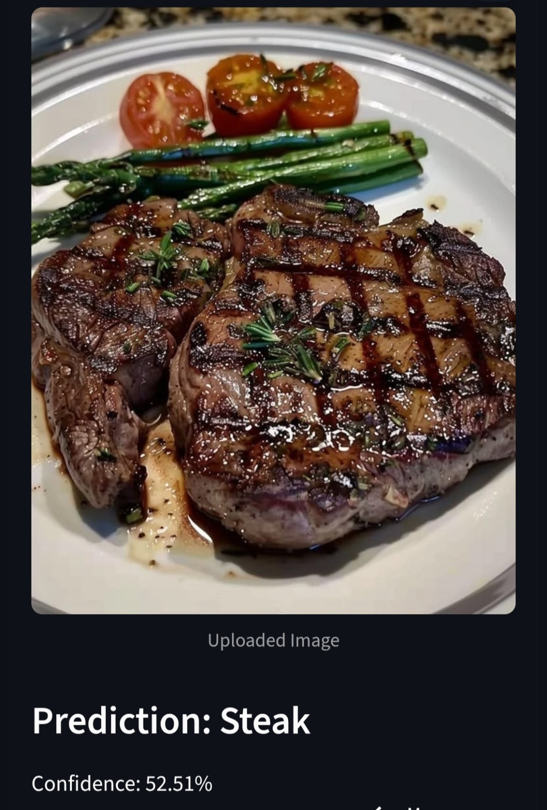

# 🍽️ Food-101 Image Classifier

A deep learning image classifier that identifies 101 different food dishes from a photo, built with TensorFlow/Keras and deployed as a live web app.

### 👉 [Try the Live App](https://foodclassification-kvcdyhy5gecvkpdsbqjk55.streamlit.app/)

---

## 📸 Example

Steak plate correctly classified with 52.51% confidence — Food-101 doesn't have an exact "steak" class, so this is the closest match the model found.

---

## 📊 Model

| | |
|---|---|
| **Architecture** | MobileNetV2 (transfer learning from ImageNet) |
| **Dataset** | Food-101 — 101 classes, ~101,000 images |
| **Test Accuracy** | 66% |
| **Training** | Frozen base + data augmentation, then fine-tuned top 30 layers at lr=1e-5 |

---

## 🛠️ Tech Stack

- TensorFlow / Keras
- Streamlit (deployment)
- Google Colab (T4 GPU)

---

## 📁 Repo Structure

- app.py — Streamlit web app
- food101_mobilenetv2.keras — Trained model
- classes.json — Class label mapping
- requirements.txt — Dependencies
- Images/ — Screenshots used in this README

---

## 🚀 Run Locally

pip install -r requirements.txt
streamlit run app.py

---

## 📈 Training Notes

- Started with a frozen MobileNetV2 base → overfit quickly (train/val gap widened, val loss rose)
- Added data augmentation (random flip, rotation, zoom) → fixed overfitting, val accuracy tracked train accuracy closely
- Fine-tuned the top 30 layers of the base model at a low learning rate → accuracy improved from ~54% to 66%

---

## 🔮 Possible Improvements

- Swap in a larger backbone (EfficientNet) for higher accuracy
- Show top-3 predictions instead of just top-1
- Extend fine-tuning for a few more epochs

---

*Built as part of a self-directed machine learning portfolio.*
